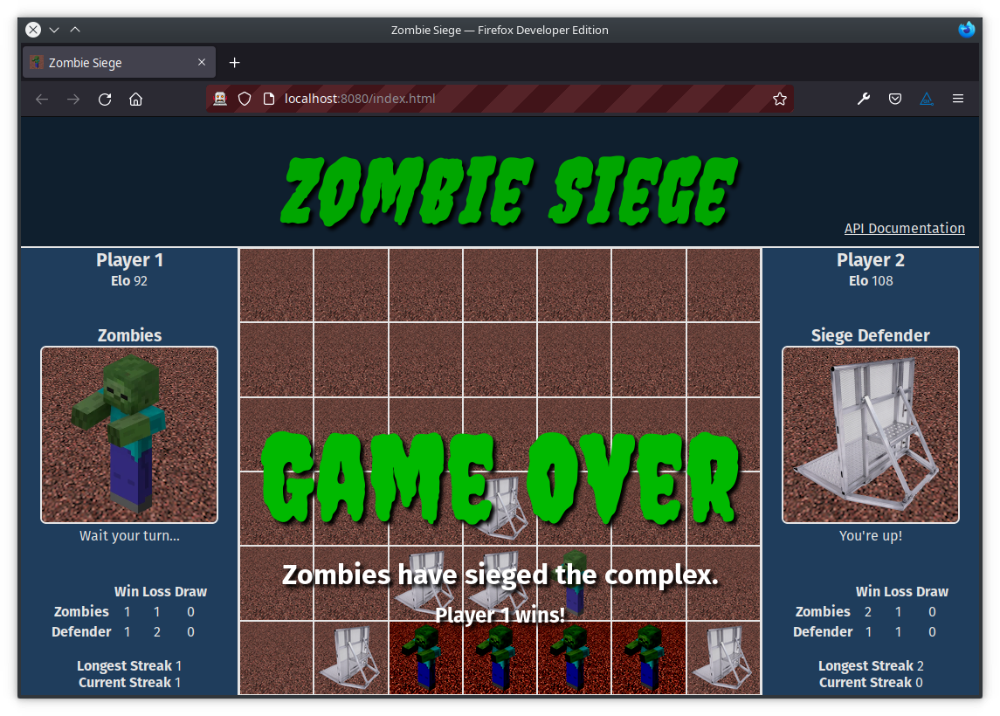

# Zombie Siege
Zombie Siege is a
[Connect Four](https://en.wikipedia.org/wiki/Connect_Four)
style game as an example submission for the
[Computing 2: Applications](https://github.com/fourier-space/Computing-2-Applications)
coursework.

